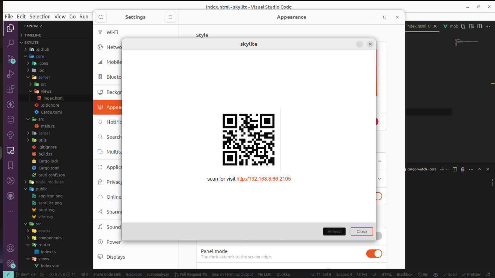

# Skylite



- [Description](#description)
- [Getting Started](#getting-started)
  - [Dependencies](#dependencies)
  - [Installing](#installing)
  - [Executing program](#executing-program)
- [License](#license)
- [Acknowledgments](#acknowledgments)

## Description

Cross platform file sharing application application for desktop and wifi-enabled devices

## Getting Started

### Dependencies

To run the application in development, you'll need the following dependencies:

- [Node.js](https://nodejs.org) - A JavaScript Runtime environment
- [Yarn](https://yarnpkg.com/) - A fast, secure and reliable package manager for Node.js
- [Rust v1.70 or greater](https://www.rust-lang.org/) - A language empowering everyone
  to build reliable and efficient software.

In addition, this project uses Tauri v1.3, see [prerequisite](https://tauri.app/v1/guides/getting-started/prerequisites/) for your operating system.

Once you have the dependencies installed, clone the project and install the required packages:

```sh
git clone https://github.com/opeolluwa/skylite.git
cd skylite # navigate to the cloned directory
yarn install && cd pwa && yarn install && cd ../ # install the dependencies
yarn tauri dev # run the application locally

```

### Installing

Download the latest release [release page](https://github.com/opeolluwa/skylite/releases)

### Executing program

- Create Wifi Hotspot on your mobile
- Connect a laptop to the Phone's Wifi Hotspot
- Visit the displayed URL or scan the QR code

## License

This project is licensed under the [GNU GENERAL PUBLIC LICENSE Version 3](./LICENSE) License - see the LICENSE.md file for details

## Acknowledgments

The project is adapted from [another application](https://github.com/opeolluwa/filesync) I'm building for cross-platform file transfer on PC's
